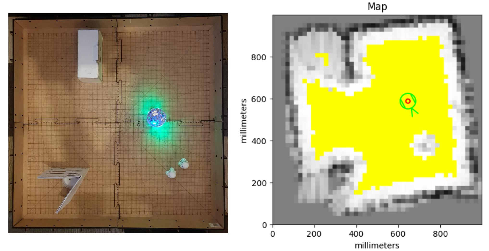
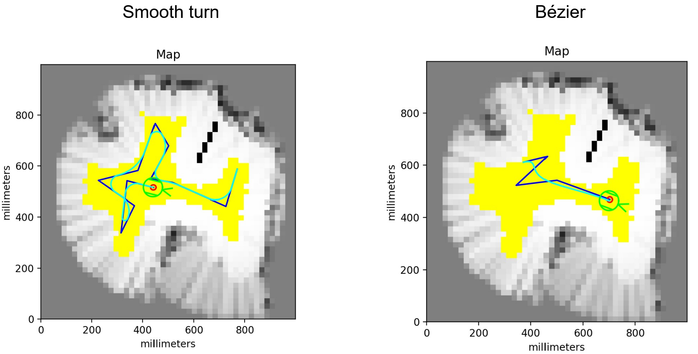
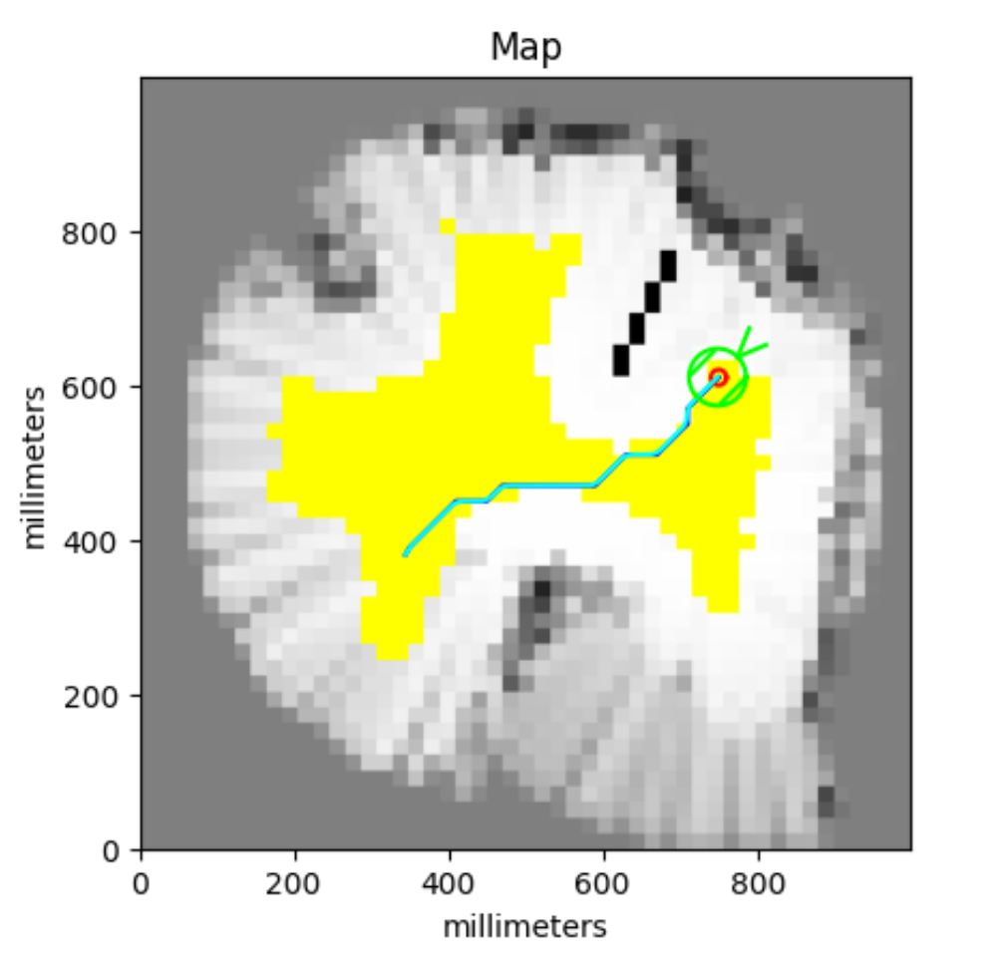
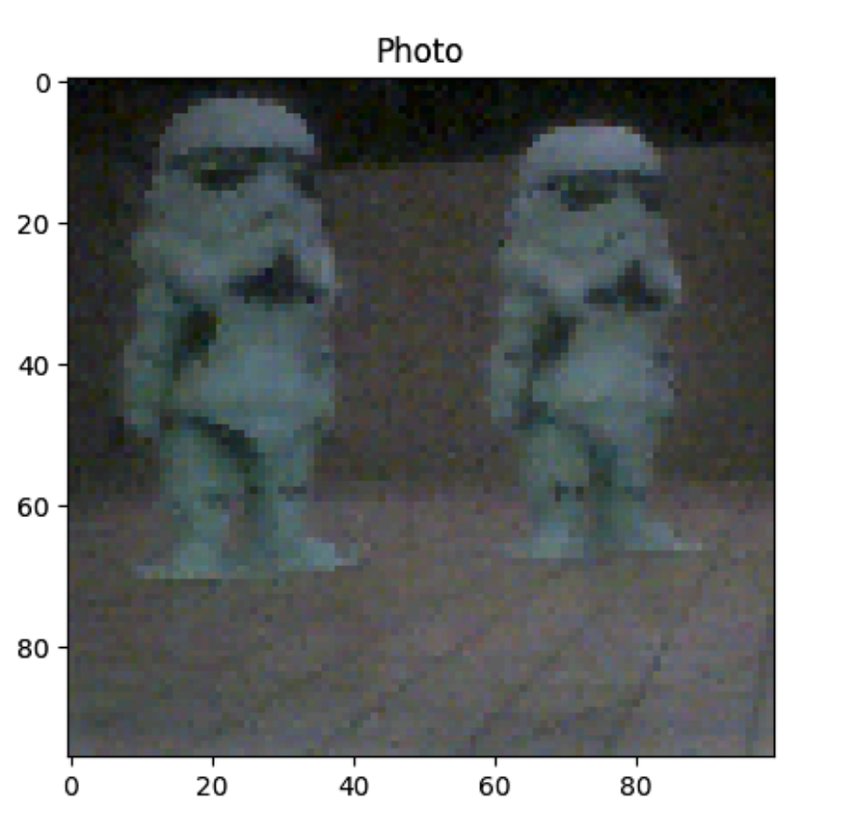

# Pathfinder

The 2022 Embedded Systems and Robotics project of Gilles Regamey and Mathieu
Schertenleib

Video link: https://www.youtube.com/watch?v=VZcvgjDBHKk

---

### Map generation

---

### Moving with smooth turns and following Bézier curves

---

### A* pathfinding

---

### Using the onboard camera

